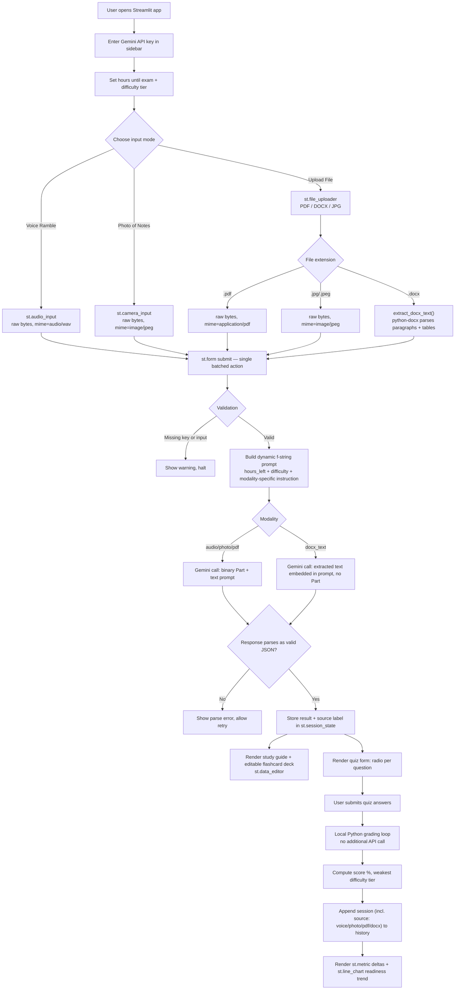

# System Architecture — CramCoach

## High-Level Data Flow

## Component Breakdown

| Layer | Technology | Responsibility |
|---|---|---|
| Presentation | Streamlit widgets (`st.form`, `st.audio_input`, `st.camera_input`, `st.file_uploader`, `st.metric`, `st.data_editor`, `st.radio`) | Capture voice/photo/file input, exam-pressure config, and render results |
| State Management | `st.session_state` | Persists API key session, current cram kit, quiz answers/grading state, and multi-session history |
| AI Integration | `google-genai` SDK → Gemini 2.0 Flash (native audio, vision, and PDF understanding) | Single-call pipeline: audio/image/PDF bytes or extracted text in, structured study guide + flashcards + quiz JSON out |
| Document Parsing | `python-docx` | Local, pre-API extraction of paragraph and table text from uploaded `.docx` files (the one modality Gemini can't ingest as a binary Part) |
| Grading Layer | Pure Python (no API call) | Compares user's selected radio index to `correct_index` per question, computes score %, identifies weakest difficulty tier |
| Data Layer | Pandas | Converts flashcards and history into DataFrames for `st.data_editor` and `st.line_chart` |
| Deployment | Streamlit Community Cloud | Hosts the app; `requirements.txt` pinned, no local system dependencies |

## Why Native Audio / Vision / PDF Input (Not a Separate Transcription/OCR Step)?

Gemini 2.0 Flash accepts audio bytes, image bytes, and PDF bytes
directly as a `types.Part`, so a voice recording, a photo, or an
uploaded PDF is sent straight to the model in the same call that
generates the study guide, flashcards, and quiz. This avoids a second
API round-trip (a separate speech-to-text call, or a separate OCR call
for handwriting or scanned PDFs), reducing both latency and cost while
satisfying the rubric's multimodality requirement across three distinct
modalities.

DOCX is the one exception: Gemini's API does not accept `.docx` as an
inline `Part`, so `extract_docx_text()` uses **python-docx** to pull
plain text out of paragraphs and tables locally, and that extracted
text is embedded directly into the prompt instead of a binary Part. A
length guardrail (`MAX_DOCX_CHARS`) truncates unusually long documents
so the prompt stays within a safe token budget.

All four input paths converge on one shared `generate_cram_kit()`
function and a single output schema; only the `input_kind`, the
`mime_type`/bytes (or extracted text), and one line of modality-specific
instruction text differ. This keeps the downstream pipeline (parsing,
flashcards, quiz, grading, history) completely input-agnostic — a
deliberate design choice so that adding a fifth input modality later
would only require a new capture widget and a new branch, not a new
pipeline.

## Why Local (Not AI) Grading?

The quiz is graded entirely in Python by comparing the student's
selected option index to the `correct_index` returned by Gemini at
generation time. This is a deliberate architecture choice: grading is a
deterministic operation and does not need another LLM call, which keeps
the app fast, free to re-take, and immune to the model "changing its
mind" about what's correct between generation and grading.

## Why Time-Aware Prompting?

The `hours_left` and `difficulty` values are injected into the user
prompt via f-strings, directly influencing how the model triages content
("Panic Mode" instructs the model to ruthlessly prioritize only the
highest-yield concepts). This is what makes the app behave differently
at 2 hours vs. 2 days out, rather than generating generic study notes.

## Error Handling

- Missing API key → inline `st.error`, no API call attempted.
- Missing audio recording → inline `st.warning`, no API call attempted.
- Malformed JSON from the model → caught via `try/except JSONDecodeError`,
  user is prompted to retry rather than the app crashing.
- General API failures (rate limit, network) → caught by a broad
  `except Exception` with the error surfaced to the user.
